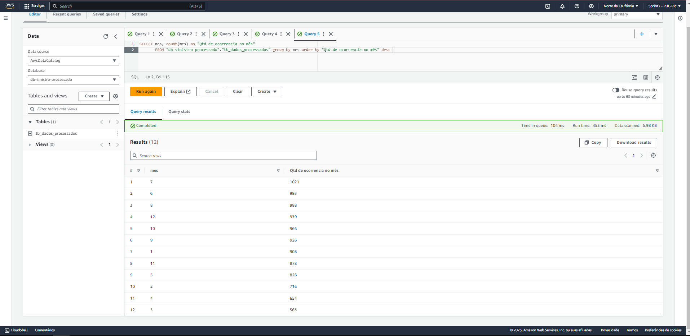

# MVP_PUC_RIO_SPRINT03
#3º MVP DA PÓS-GRADUAÇÃO EM CIÊNCIA DE DADOS E ANALYTICS - PUC-RIO (ENGENHARIA DE DADOS)

**Detalhamento:** A base de dados utilizada foi retirada do catálogo de dados abertos da cidade de Fortaleza-Ce. A base é da Autarquia Municipal de Trânsito e Cidadania (AMC).
-   **Ano:** 2021
-   **Tipo:** CSV
- **Tamanho:** 10418
-   **Link:** https://dados.fortaleza.ce.gov.br/dataset/sinistros-2021

**Nuvem utilizada:** Amazon AWS - Ferramentas em nuvem utilizadas:
-   S3 AWS - Armazenamento
-   AWS Glue - Catálogo de dados e processo ETL
-   Athena AWS - Análise via SQL

# Objetivo: Responder às seguintes perguntas.

-   Qual o transporte mais envolvido em acidentes?
-   Dos transportes envolvidos em acidentes, quais houve mais mortes?
-   Dos transportes envolvidos em acidentes, quais houve mais pessoas ilesas?
-   Quais os 10 endereços responsáveis pela maior ocorrência de sinistros de trânsito?
-   Qual mês do ano teve mais acidentes? Qual dia do mês? Qual o horário do dia?
-   Qual mês do ano teve mais mortes? Qual dia do mês?
-   Das ocorrências, em qual endereço houve mais mortes?
-   Dos acidentes ocorridos, quais os 10 tipos mais frequentes?
-   Dos acidentes ocorridos, quais os 10 tipos mais frequentes por endereço? 
-   A cada quantos acidentes temos ocorrência de morte?

## **Etapas Pré-análise**

Buckets Utilizados.

O bucket **repo-sprint03** foi criado para armazenar o dataset e os demais foram criados automaticamente para armazenar os metadados do Athena e Glue AWS.

DataSets do bucket **repo-sprint03**

Temos então três pastas, uma para armazenar as consultas feitas no Athena **( a )** , uma para armazenar os dados brutos **( b )** , e outra para armazenar os dados processados **( c )** .

a)

b)

c)

## Uso do AWS Glue

Utilizei o AWS Glue para criar dois crawlers, um deles para varrer os dados brutos e jogar em um uma base de dados disponível para outros serviços como o processo ETL. Trabalhar com os dados em um banco de dados no Glue é melhor do que diretamente no S3, algumas funcionalidades do processo de ETL como exclusão de colunas só ficou disponível quando na carga utilizei uma base de dados do Glue e não diretamente do S3. O processo de ETL resulta em uma nova base de dados no S3, mostrada na figura ( c ). Para fazer as consultas no Athena criei outro crawler para varrer os dados processados no S3 e carregar em um novo banco no Glue, esse banco será utilizado para as consultas em SQL. O registro dessas etapas segue nas figuras a seguir.

Crawlers

  **-----------------------------------------------------------------------------------------------------------------**

  **-----------------------------------------------------------------------------------------------------------------**

Bases de dados AWS Glue

  **-----------------------------------------------------------------------------------------------------------------**

  **-----------------------------------------------------------------------------------------------------------------**

## Processo ETL no AWS GLue

  **-----------------------------------------------------------------------------------------------------------------**

  **-----------------------------------------------------------------------------------------------------------------**

  **-----------------------------------------------------------------------------------------------------------------**

  **-----------------------------------------------------------------------------------------------------------------**
 

## Análise das informações via AWS Athena

Qual o transporte mais envolvido em acidentes?

  **-----------------------------------------------------------------------------------------------------------------**
  
Dos transportes envolvidos em acidentes, quais houve mais mortes?

Antes da consulta, já tinha julgado que esse seria o resultado, pelo menos para a motocicleta e carro. Em relação a motocicleta, se deve ao fato de não ser um transporte seguro por natureza, além de outros fatores que acometem as demais categorias como imprudência e falta de sinalização.
  
  **-----------------------------------------------------------------------------------------------------------------**
  
Dos transportes envolvidos em acidentes, quais houve mais pessoas ilesas?

Aqui vale uma explicação: transporte de tração animal e trem não teve pessoas ilesas porque estão dentro da categoria de feridos. Outra observação: é claro que o carro tem muitos aparatos de segurança como airbag e etc, no entanto, não é só por isso que tem mais ocorrências de pessoas ilesas, outro fator é que é muito utilizado e é um dos que têm mais ocorrências de sinistros, e obviamente vai ter um número maior de ilesos. 

  **-----------------------------------------------------------------------------------------------------------------**
  
Quais os 10 endereços responsáveis pela maior ocorrência de sinistros de trânsito?

  **-----------------------------------------------------------------------------------------------------------------**
  
Qual mês do ano teve mais acidentes?

  **-----------------------------------------------------------------------------------------------------------------**
  
 Qual dia do mês?
 

  **-----------------------------------------------------------------------------------------------------------------**
  
Qual o horário do dia?

  **-----------------------------------------------------------------------------------------------------------------**
  
Qual mês do ano teve mais mortes?

  **-----------------------------------------------------------------------------------------------------------------**
  
 Qual dia do mês?
 

  **-----------------------------------------------------------------------------------------------------------------**
  
Dos acidentes ocorridos, quais os 10 tipos mais frequentes?

  **-----------------------------------------------------------------------------------------------------------------**
  
Dos acidentes ocorridos, quais os 10 tipos mais frequentes por endereço?

  **-----------------------------------------------------------------------------------------------------------------**
  
Qual a relação de mortes por acidentes? Ou seja, a cada quantos acidentes temos pelo menos uma morte?

Podemos entender essa informação da seguinte forma, a cada **10418 mil** sinistros de trânsito ocorrem pelo menos **1,62 mortes** na cidade de Fortaleza. Levando em consideração o tamanho da base de **10418** registros de sinistros referente ao ano de **2021**.

# Considerações finais

Esse trabalho fez uma análise de uma base de dados de sinistros de trânsito da cidade de Fortaleza, Ceará. Para isso, utilizou a nuvem Amazon AWS para armazenar, catalogar, fazer todo processo de ETL e análise. As perguntas feitas sobre os dados são pertinentes levando em consideração minha visão de autor, obviamente existem muitas outras perguntas pertinentes que esse trabalho não respondeu. Durante o processo foram encontradas algumas dificuldades em relação a plataforma, especialmente sobre a região escolhida, que em outros serviços da mesma plataforma não eram visíveis, pois outra região era escolhida de forma automática, tendo que refazer alguns passos. Sobre os dados, trata-se de uma base com muitos campos, logo alguns foram removidos no processo ETL. Pude perceber que alguns campos foram preenchidos a mão no sistema que gerou os dados, isso porque continha erros de digitação, principalmente no endereço das ocorrências. Por conta disso, os dados ainda podem apresentar ruídos. Levando em consideração o todo posso dizer que objetivo do trabalho foi atingido.
